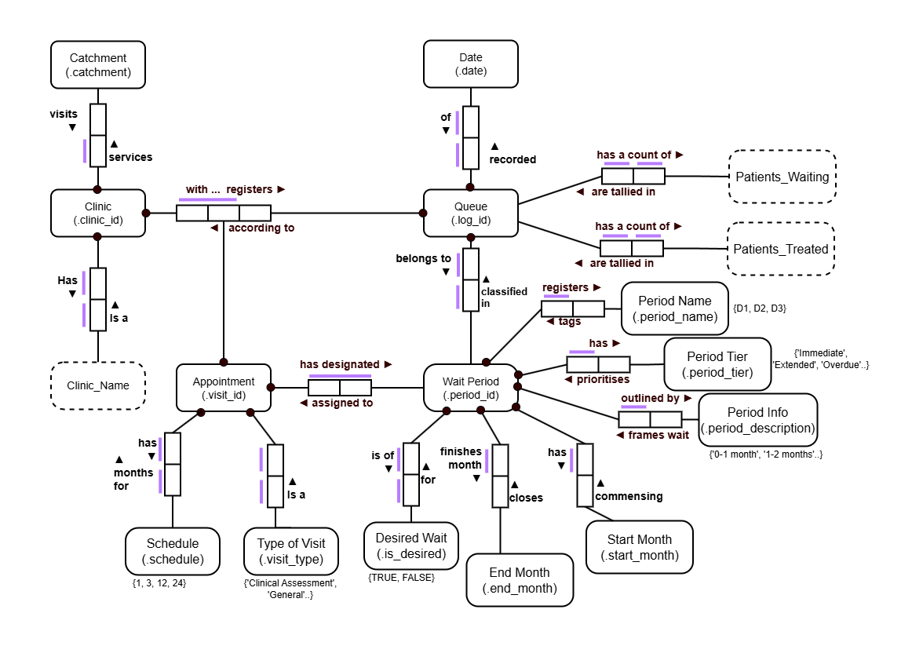

# [Queensland Dental Waiting List](https://www.data.qld.gov.au/dataset/public-dental-waiting-list) — Database Design

## Overview
The Queensland Dental Waiting List data tracks patient movement in and out of waiting and treated status across participating clinics in different regions.  

This step of the project designs a **relational database** that supports analysis of:
- Patient wait times  
- Clinic performance  
- Trends over multiple years  

---

## Data Sources

- Data is provided in multiple XLSX files, organized by financial year and quarter.  
- Each file contains:
  - Date / quarter  
  - Appointment type or service “area”  
  - Number of patients waiting and treated  
  - Participating clinics and serviceable regions  

> **Source Description (Open Data Portal)**  
> Oral health data is collected from Queensland Health dental clinics.  
> It details:
> - Number of adult dental appointments  
> - Number waiting for assessment  
> - Length of wait time by priority  
>
> Some services use a standardized questionnaire to assign patients to a priority category.  
> Data is updated monthly and considered preliminary.  
> “–” indicates unavailable data.

---

## Flat File Example

| date | clinicID | clinicName | Hospital and Health Service | Area | Waiting D1 | Waiting D2 | Waiting D3 | Waiting D4 | Waiting D5 | Waiting D6 | Waiting D7 | Treated D1 | Treated D2 | Treated D3 | Treated D4 | Treated D5 | Treated D6 | Treated D7 |
|------|-----------|-------------|-----------------------------|------|------------:|------------:|------------:|------------:|------------:|------------:|------------:|------------:|------------:|------------:|------------:|------------:|------------:|------------:|
| 30/06/2024 | 1 | KAWANA DENTAL CLINIC | Sunshine Coast | Clinical Assessment | 0 | 0 | 0 | 0 | 0 | 0 | 0 | - | 43 | 0 | 0 | 0 | 0 | 100 |
| 30/06/2024 | 1 | KAWANA DENTAL CLINIC | Sunshine Coast | General | 1,646 | 1,514 | 1 | 0 | 0 | 0 | 0 | 100 | 1 | 116 | 4 | 0 | 0 | 97 |
| 30/06/2024 | 1 | KAWANA DENTAL CLINIC | Sunshine Coast | Priority 1 | 0 | 0 | 0 | 0 | 0 | 0 | 0 | - | 2 | 0 | 0 | 0 | 0 | 100 |
| 30/06/2024 | 1 | KAWANA DENTAL CLINIC | Sunshine Coast | Priority 2 | 48 | 63 | 40 | 37 | 29 | 2 | 22 | 9 | 21 | 22 | 22 | 1 | 12 |

---

## Distinct Appointment Areas

| Appointment Type | Description |
|------------------|-------------|
| **Clinical Assessment** | Determines treatment priority; desirable within **1 month** |
| **General** | Routine check-ups and treatment; desirable within **24 months** |
| **Priority 1** | Treatment desirable within **1 month** |
| **Priority 2** | Treatment desirable within **3 months** |
| **Priority 3** | Treatment desirable within **12 months** |
| **General Anaesthetic Category 1** | Under GA, desirable within **1 month** |
| **General Anaesthetic Category 2** | Under GA, desirable within **3 months** |
| **General Anaesthetic Category 3** | Under GA, desirable within **12 months** |

---

## Waiting Time Ranges (Months)

| Wait List | D1 | D2 | D3 | D4 | D5 | D6 | D7 |
|------------|:--:|:--:|:--:|:--:|:--:|:--:|:--:|
| Clinical Assessment | < 1 | 1–2 | 2–3 | 3–4 | 4–5 | > 5 | ^ |
| General | < 12 | 12–24 | 24–36 | 36–48 | 48–60 | > 60 | ^ |
| Priority 1 | < 1 | 1–2 | 2–3 | 3–4 | 4–5 | >5 | ^ |
| Priority 2 | < 3 | 4–6 | 7–9 | 10–12 | 13–15 | > 15 | ^ |
| Priority 3 | < 6 | 7–12 | 13–18 | 19–24 | 25–30 | > 30 | ^ |
| GA Category 1 | < 1 | 1–2 | 2–3 | 3–4 | 4–5 | > 5 | ^ |
| GA Category 2 | < 3 | 4–6 | 7–9 | 10–12 | 13–15 | > 15 | ^ |
| GA Category 3 | < 6 | 7–12 | 13–18 | 19–24 | 25–30 | > 30 | ^ |

> **^ = % within recommended waiting time**

---

## Database & Data Modelling

> Guided by:  
> *Information Modeling and Relational Databases* (2nd Ed.) — Terry Halpin & Tony Morgan  

### Universe of Discourse
**Queensland Dental Waitlist System**

### Identified Entities

| Entity | Description |
|--------|--------------|
| **Clinic** | Participating clinic (clinic name, ID, catchment) |
| **Appointment** | Appointment type (description, wait period) |
| **Catchment** | Geographic service area |
| **Wait_Period** | Ranges of wait time by appointment type |
| **Queue** | Records patients waiting/treated for a clinic-period |
| **Date** | Quarterly reporting date |

---

### Identified Relationships

| # | Elementary Fact | Example | Uniqueness |
|:-:|------------------|----------|-------------|
| 1 | Clinic *offers* Appointment | Kippa-Ring Central Clinic offers General appointments | 1:n |
| 2 | Queue *includes* Patients_Waiting | Queue_Log D1 has 120 patients waiting | 1:1 |
| 3 | Queue *includes* Patients_Treated | Queue_Log D1 has 10 patients treated | 1:1 |
| 4 | Clinic *with* Appointment *has* Queue | Kippa-Ring Clinic’s General Appointment has Queue_Log | n:m |
| 5 | Clinic *services* Catchment | Each Clinic has a catchment area | n:1 |
| 6 | Appointment *has* Wait Period | Each Appointment defines wait period criteria | 1:n |
| 7 | Appointment *outlined by* Description | Appointment type is described by text | 1:1 |
| 8 | Queue *records* Date | Each Queue log is time-stamped by date | 1:1 |
| 9 | Clinic_ID *represents* Clinic Name | Clinic_ID ‘023’ belongs to Kippa-Ring Central | 1:1 |

---

## ORM Schema — Queensland Dental Waitlist System

---

### Relational Schema Mapping  

> **Legend:**  
> { <u><b>primary_key</b></u>, <u>foreign_key</u>, *candidate_key*, nullable_field }

| Table | Fields |
|-------|---------|
| **clinic** | { **clinic_id**, *clinic_name*, catchment } |
| **appointment** | { **visit_id**, visit_type, schedule } |
| **wait_period** | { **period_id**, period_name, period_tier, period_description, start_month, end_month, is_desired } |
| **appointment_waitperiod** | { **visit_id**, **period_id** } |
| **queue** | { **log_id**, date, **period_id**, **clinic_id**, patients_waiting, patients_treated } |

---

## Implementation Steps

1. Convert `.xlsx` files to `.csv` using Python  
2. Combine CSVs into a master dataset  
3. Design ORM and normalized relational tables  
   - Use explicit, consistent naming (`snake_case`)  
   - Convert data from wide >> long format  
4. Create database in PostgreSQL  
5. Create tables: `clinic`, `appointment`, `appointment_waitperiod`, `wait_period`, `queue`  
6. Create a temporary table `stage_raw` for master data import  
7. Insert distinct ID values from staging into relational tables  
8. Update relational tables with correct key references  
9. Manually fill `appointment` and `wait_period` tables per Queensland Health documentation  
10. Populate junction table `appointment_waitperiod` (linking appointments and wait periods)  
11. Normalize queue data from wide >> long using CTE with row grouping (tiers + periods)  
12. Insert combined data into `queue` with mapped foreign keys  

---

## References

- [Queensland Health Performance – Oral Health Care](https://www.performance.health.qld.gov.au/statewide-performance/prevention-early-intervention-and-primary-health-care/oral-health-care)  
- [AIHW: Oral Health and Dental Care in Australia](https://www.aihw.gov.au/reports/dental-oral-health/oral-health-and-dental-care-in-australia/contents/introduction)  
- [AIHW: Dental & Oral Health Data Sources](https://www.aihw.gov.au/reports-data/health-conditions-disability-deaths/dental-oral-health/data-sources)  
- [ABC News: QLD Fluoride & Tooth Decay Study](https://www.abc.net.au/news/2025-10-15/qld-fluoride-water-tooth-decay-study-rates-plummet/105888306)  
- [MJA: Socio-Economic Status & Fluoridated Water Access](https://www.mja.com.au/journal/2024/220/2/socio-economic-status-and-access-fluoridated-water-queensland-ecological-data#:~:text=We%20estimated%20that%204%20050,fluoridated%20SA2s%20(Box%205).)
